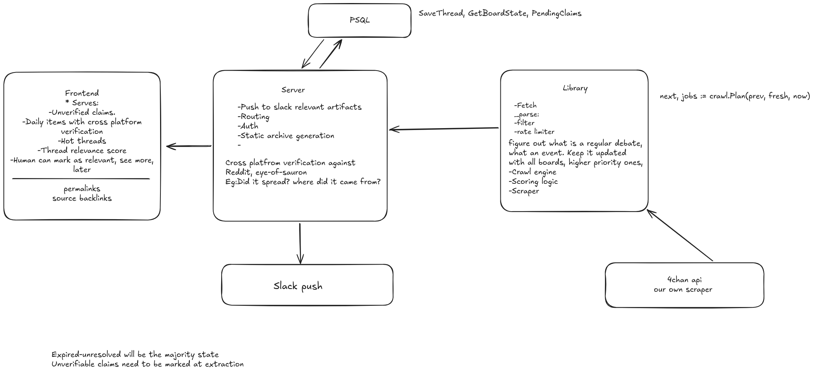

## Architecture

Target:

Harvest 4chan continuously, filter it down, and surface the small fraction
worth looking at. The bet is that being early is worth something.

Why:

anonymity means no reputational cost to posting, so leaks land here before anywhere that requires an account

Not useful for the merely popular. Memes, discourse, breaking news all reach Twitter/Reddit first.

Roadmap: 

Done:
-Live tier. Catalog polling (currently /g/ and /biz/).
-Rationale expanding. Findings linked to source threads.
-See evolution across sources. General thread lineage across reposts.
-Narrative summaries. Hour/day/week LLM digests of findings/generals activity.

Next, in priority order:
-Board coverage. Widen the watchlist toward ~10 boards.
-Detection quality. Better prompts/techniques for the classifier and summarizer.
-UI. Keep improving the findings/generals/summary surfaces.
-Push items to Slack, instead of dashboard-only.
-Noise marking. Let findings be flagged as false positives, to calculate false-negative/precision rates and close the loop on prompt tuning.

TLDR:
-rate limit shouldnt be a problem in most boards, if you fetch each thread once near end-of-life instead of polling it live.
-Three tiers of the same items at different maturity:
    -live (minutes).
    -daily (corroboration checked)
    -weekly (hindsight and a verdict).
-Filtering everything with an LLM is affordable: 250 week mid tier models, 2000 if highest tier with no filtering.

4chan boards are ephemeral, so:
-No upvotes, no identity, no search, threads deleted within hours.

Some things that got published here first:

| Thing | Where | When |
|---|---|---|
| Meta's LLaMA weights, by torrent | /g/ | Mar 2023 — first public leak of a major lab's proprietary model |
| QAnon's first posts | /pol/ | Oct 2017 |
| Nintendo "gigaleak" | /vp/, /v/ | Jul 2020 |
| 2014 celebrity photo leak | /b/ | Aug 2014 |

550k posts/day → ~3.85M/week
(watchlist boards are ~20% of that)

Cost, batched by thread and site-wide: ~$25/week with a cheap model,
  ~$250 Haiku-class, ~$730 Sonnet-class, Opus-class	~$3,700. Watchlist-only (~10 boards) is
  about a fifth of that. Estimates from published prices, not measured.
